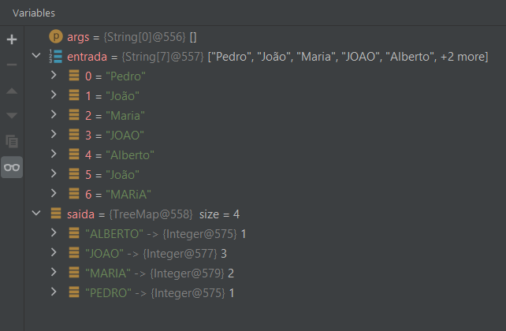

# Teste de Java
Soluções para o teste Java.

## Questão 1

Escreva uma classe chamada ```ComplexNumber``` para representar números complexos. Números complexos possuem a estrutura ```z = x + y*i``` (onde x é a parte real e y é a parte imaginária):
  * O construtor padrão deve inicializar as partes real e imaginária com zero. Deve haver outro construtor, que possibilite passar os valores como parâmetro.;
  * Escreva um método de instância que some o número complexo passado como parâmetro, dado que a soma de números complexos é definida da seguinte maneira: ```(a + bi) + (c + di) = (a + c) + (b + d)i```;
  * Escreva um método estático que some dois números complexos passados como parâmetro e retorne um terceiro número complexo. **Evite duplicidade de código**.

## Questão 2

Escreva um método que recebe uma lista de strings como parâmetro. Essa lista possui uma série de nomes próprios, podendo conter nomes repetidos. O método deve retornar um objeto com o número de ocorrências por nome, com a contagem seguindo a ordem alfabética dos nomes. A contagem de ocorrências por nome deve ser case-insensitive e deve ignorar acentuação (“João” e “jOao” são considerados como sendo o mesmo nome). **Não utilize funções Lambda**.

Exemplo de entrada:

```{“Pedro”, “João”, “Maria”, “JOAO”, “Alberto”, “João”, “MARiA”}```

Saída esperada:

```{“ALBERTO” = 1, “JOAO” = 3, “MARIA” = 2, “PEDRO” = 1}```

### Resposta

A resposta em forma de código se encontra aqui: [./resposta_2](./resposta_2)

O resultado do mesmo funcionando:



## Questão 3

Considere um sistema que tem os seguintes requisitos:
  * Como usuário, quando seleciono "Cidades" quero ver a lista de cidades;
  * Como usuário, quando seleciono uma cidade quero ver a lista de filmes;
  * Como usuário, quando seleciono um filme quero ver a lista de cinemas;
  * Como usuário, quando seleciono um cinema quero ver a lista de horários;
  * Como usuário, quando seleciono um horário e informo o número de assentos quero ver os assentos disponíveis;
  * Como usuário, quando seleciono o(s) assento(s) quero ver o preço total;
  * Como usuário, quando seleciono "Concluir Compra" quero ser redirecionado a um gateway de pagamento;
  * Como usuário, quando realizo o pagamento quero receber o(s) ingresso(s) por e-mail.

  1. Crie um modelo de banco de dados (entidade relacionamento) de forma a atender aos requisitos deste sistema.
  2. Escreva as queries em SQL para responder aos requisitos colocados acima.
